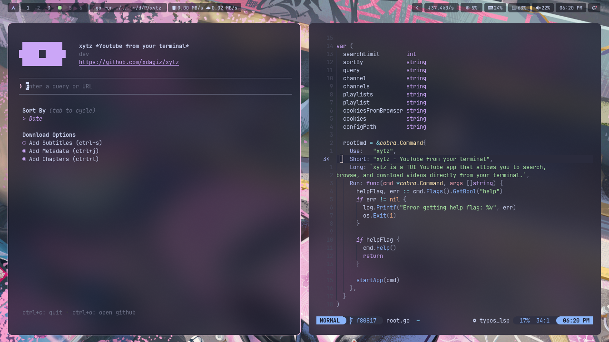

# My Dotfiles

- **Terminal**: Alacritty
- **Editor**: Neovim
- **Shell**: fish + starship
- **WM**: Niri
- **Bar**: Waybar
- **Launcher**: Rofi
- **Colorscheme**: Catppuccin Mocha
- **Other**: tmux, jj, btop, mako, wofi

## Screenshots

<p align="center">
  
</p>

<!-- <p align="center"> -->
<!--    -->
<!--    -->
<!-- </p> -->


## Installation

````bash
git clone https://github.com/xdagiz/dots ~/dotfiles

# Symlink everything into $HOME
stow -d ~/dotfiles -t ~ home

# Or, if stow is invoked inside the repo:
cd ~/dotfiles && stow home
````
